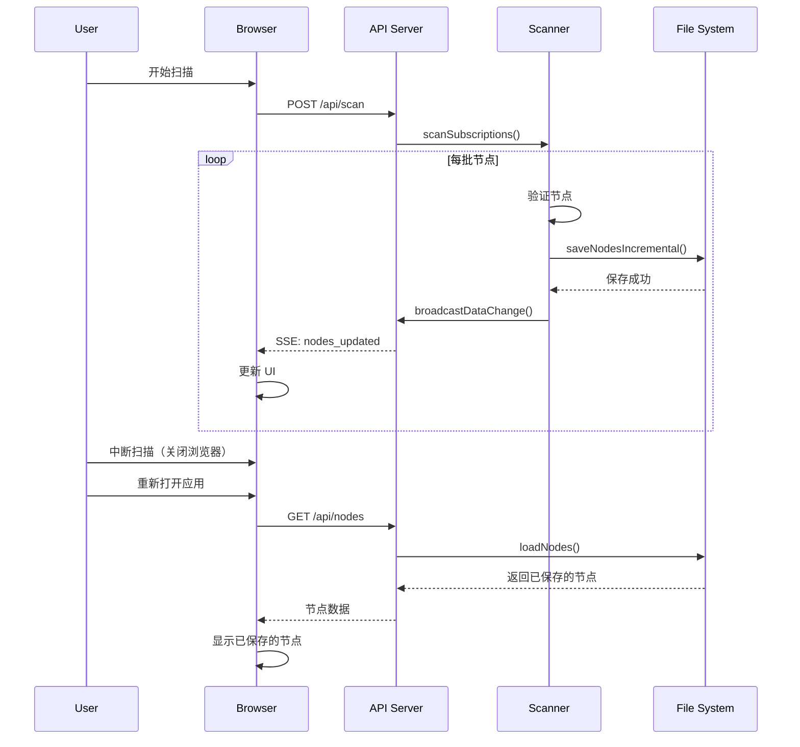
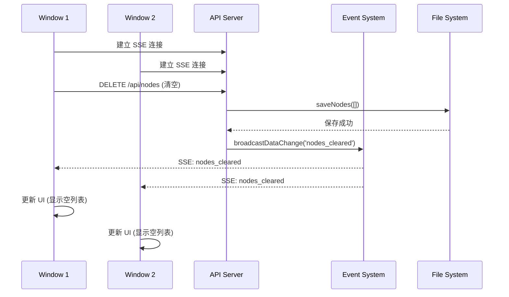

# Design Document

## Overview

本设计文档描述了代理池管理系统的三个关键改进功能的技术实现方案。这些改进将增强系统的用户体验、数据可靠性和多窗口协作能力。

设计遵循现有的 Next.js App Router 架构，使用 Server-Sent Events (SSE) 进行实时通信，并通过文件系统持久化数据。

## Architecture

### 系统架构概览

```
┌─────────────────────────────────────────────────────────────┐
│                     Browser Windows                          │
│  ┌──────────┐  ┌──────────┐  ┌──────────┐                  │
│  │ Window 1 │  │ Window 2 │  │ Window N │                  │
│  └────┬─────┘  └────┬─────┘  └────┬─────┘                  │
│       │             │             │                          │
│       └─────────────┴─────────────┘                          │
│                     │                                        │
│              SSE Connections                                 │
└─────────────────────┼────────────────────────────────────────┘
                      │
┌─────────────────────┼────────────────────────────────────────┐
│              Next.js Server                                  │
│                     │                                        │
│  ┌──────────────────▼─────────────────────────┐            │
│  │         Event Broadcasting Layer            │            │
│  │  (scanEvents + broadcastDataChange)         │            │
│  └──────────────────┬─────────────────────────┘            │
│                     │                                        │
│  ┌──────────────────▼─────────────────────────┐            │
│  │           API Routes Layer                  │            │
│  │  /api/nodes  /api/scan  /api/scan/progress │            │
│  └──────────────────┬─────────────────────────┘            │
│                     │                                        │
│  ┌──────────────────▼─────────────────────────┐            │
│  │         Business Logic Layer                │            │
│  │  scanner.ts  store.ts  events.ts            │            │
│  └──────────────────┬─────────────────────────┘            │
└─────────────────────┼────────────────────────────────────────┘
                      │
┌─────────────────────▼────────────────────────────────────────┐
│              File System (data/)                             │
│  nodes.json  config.json                                     │
└──────────────────────────────────────────────────────────────┘
```

### 关键设计决策

1. **增量保存机制**: 在扫描过程中，每完成一批节点验证后立即保存到文件系统
2. **事件驱动架构**: 使用 EventEmitter 广播数据变更，所有连接的客户端通过 SSE 接收更新
3. **无状态 API**: API 路由保持无状态，所有状态通过文件系统和事件系统管理
4. **乐观更新**: 前端在执行操作后立即更新 UI，同时等待服务器确认

## Components and Interfaces

### 1. 事件广播系统 (Event Broadcasting System)

#### 新增事件类型

```typescript
// src/lib/events.ts

export interface DataChangeEvent {
  type: 'nodes_updated' | 'nodes_cleared' | 'config_updated';
  timestamp: string;
  data?: any;
}

// 新增函数
export function broadcastDataChange(event: DataChangeEvent): void;
```

**职责**:
- 广播数据变更事件到所有连接的客户端
- 管理数据变更事件的订阅和取消订阅

### 2. 增量保存模块 (Incremental Save Module)

#### 现有实现增强

```typescript
// src/lib/scanner.ts

// 已存在的增量保存函数，需要确保在所有批次完成后触发广播
async function saveNodesIncremental(nodes: NodeInfo[]): Promise<void>;
```

**改进点**:
- 在保存成功后触发 `broadcastDataChange` 事件
- 添加错误重试机制（最多 3 次）
- 记录保存操作日志

### 2.1 Clash 批次测试容错模块

#### 扫描流程增强

```typescript
// src/lib/scanner.ts

interface BatchTestResult {
  batchIndex: number;
  success: boolean;
  validatedNodes: NodeInfo[];
  error?: string;
}

async function testBatchWithClash(
  batch: NodeInfo[], 
  batchIndex: number, 
  totalBatches: number
): Promise<BatchTestResult>;
```

**职责**:
- 对单个批次进行 Clash Core 测试
- 捕获批次级别的错误
- 返回批次测试结果（成功或失败）
- 失败时返回降级数据（TCP 初筛结果）

**容错逻辑**:
1. 尝试启动 Clash Core
2. 如果启动失败，记录错误并返回失败状态
3. 如果测试过程中异常，保存已测试的节点
4. 主扫描流程接收到失败状态后，跳过该批次继续下一批
5. 保留失败批次的 TCP 初筛结果作为备选

### 3. 清空代理池 API (Clear Proxy Pool API)

#### API 端点

```typescript
// src/app/api/nodes/route.ts

export async function DELETE(): Promise<NextResponse>;
```

**现有实现**: 已存在，需要添加事件广播

**改进点**:
- 在清空成功后触发 `broadcastDataChange` 事件
- 添加操作日志

### 4. 前端数据同步层 (Frontend Data Sync Layer)

#### 新增 Hook

```typescript
// src/hooks/useRealtimeNodes.ts (新文件)

export function useRealtimeNodes(): {
  nodes: NodeInfo[];
  loading: boolean;
  refresh: () => Promise<void>;
};
```

**职责**:
- 监听 SSE 数据变更事件
- 自动刷新节点数据
- 管理加载状态

### 5. SSE 数据变更端点 (SSE Data Change Endpoint)

#### 新增 API 端点

```typescript
// src/app/api/events/route.ts (新文件)

export async function GET(request: Request): Promise<NextResponse>;
```

**职责**:
- 建立 SSE 连接
- 监听 `dataChange` 事件并推送到客户端
- 处理连接断开和清理

## Data Models

### 数据变更事件模型

```typescript
interface DataChangeEvent {
  type: 'nodes_updated' | 'nodes_cleared' | 'config_updated';
  timestamp: string;
  data?: {
    totalNodes?: number;
    aliveNodes?: number;
    operation?: string;
  };
}
```

### 扫描进度模型 (现有，无需修改)

```typescript
interface ScanProgress {
  total: number;
  current: number;
  currentNode?: string;
  status: 'idle' | 'scanning' | 'completed' | 'error';
  logs: string[];
  successCount?: number;
  failedCount?: number;
}
```

### 节点信息模型 (现有，无需修改)

```typescript
interface NodeInfo {
  url: string;
  host: string;
  port: number;
  label: string;
  country?: string;
  countryCode?: string;
  region?: string;
  isp?: string;
  isNative?: boolean;
  latency?: number;
  lastCheck: string;
}
```

## Error Handling

### 1. 增量保存失败

**场景**: 在扫描过程中，文件系统写入失败

**处理策略**:
- 记录错误日志到扫描日志
- 重试最多 3 次，每次间隔 1 秒
- 如果仍然失败，继续扫描但在日志中标记警告
- 不中断扫描流程

### 2. SSE 连接断开

**场景**: 客户端网络中断或浏览器关闭

**处理策略**:
- 服务器端自动清理断开的连接
- 客户端检测到断开后自动重连（最多 5 次）
- 重连成功后立即拉取最新数据

### 3. 清空操作失败

**场景**: 删除节点数据时文件系统错误

**处理策略**:
- 返回 500 错误状态码
- 在前端显示错误提示
- 不更新前端状态，保持原有数据显示
- 记录详细错误日志

### 4. 多窗口并发操作

**场景**: 多个窗口同时执行清空或扫描操作

**处理策略**:
- 使用现有的任务锁机制 (`taskLock.ts`)
- 返回 409 Conflict 状态码
- 在前端显示友好的提示信息
- 其他窗口通过 SSE 接收操作结果

### 5. Clash Core 批次测试失败

**场景**: 在分批测试过程中，某一批的 Clash Core 启动失败或测试异常

**处理策略**:
- 记录失败批次的详细错误日志
- 跳过当前失败的批次，继续处理下一批
- 在扫描日志中标记跳过的批次和原因
- 对于跳过的批次，保留 TCP 初筛结果作为降级方案
- 扫描完成后在摘要中显示跳过的批次数量
- 不因单个批次失败而中断整个扫描流程

## Testing Strategy

### 1. 单元测试

**测试目标**:
- `broadcastDataChange` 函数正确触发事件
- `saveNodesIncremental` 在失败时正确重试
- 事件监听器正确注册和清理

**测试工具**: Jest + Node.js Test Runner

### 2. 集成测试

**测试场景**:
- 扫描过程中中断，验证已保存的节点可以加载
- 清空操作后，所有窗口都显示空列表
- 扫描完成后，所有窗口都显示相同的节点数据

**测试工具**: Playwright (E2E)

### 3. 手动测试清单

- [ ] 打开两个浏览器窗口，在一个窗口执行扫描，验证另一个窗口实时更新进度
- [ ] 扫描进行到一半时刷新页面，验证已保存的节点仍然存在
- [ ] 在一个窗口清空代理池，验证另一个窗口立即显示空列表
- [ ] 模拟网络中断，验证 SSE 自动重连
- [ ] 在扫描过程中关闭浏览器，重新打开后验证数据完整性

## Implementation Notes

### 1. 增量保存时机

当前实现已经在每批 Clash 测试完成后调用 `saveNodesIncremental`。需要确保：
- 保存操作不阻塞扫描流程
- 保存成功后立即广播事件

### 2. SSE 连接管理

- 使用 Next.js 的 `ReadableStream` API 实现 SSE
- 在 `request.signal.addEventListener('abort')` 中清理监听器
- 避免内存泄漏

### 3. 前端状态管理

- 使用 React 的 `useEffect` 监听 SSE 事件
- 在组件卸载时关闭 SSE 连接
- 使用 `useState` 管理节点数据和加载状态

### 4. 性能考虑

- 限制 SSE 推送频率（节流，最多每秒 2 次）
- 增量保存时避免频繁的文件写入（批量保存）
- 前端使用虚拟滚动优化大量节点的渲染

### 5. 并发扫描防护

**问题诊断**：
- Cron 任务的 `runScheduledScan` 函数没有使用任务锁
- 导致 cron 触发的扫描和手动扫描可以同时运行
- 多个扫描进程同时操作 Clash Core 会导致端口冲突和数据混乱

**解决方案**：
- 在 `src/cron.ts` 的 `runScheduledScan` 函数中添加任务锁检查
- 如果锁已被占用，跳过本次 cron 扫描并记录日志
- 确保所有扫描入口（API、Cron）都使用统一的任务锁机制

## Sequence Diagrams

### 扫描中断后数据恢复流程



### 多窗口数据同步流程



## Migration and Rollout

### 阶段 1: 增强事件系统
- 在 `events.ts` 中添加 `broadcastDataChange` 函数
- 创建新的 SSE 端点 `/api/events`
- 测试事件广播功能

### 阶段 2: 改进增量保存
- 在 `saveNodesIncremental` 中添加事件广播
- 添加错误重试逻辑
- 测试扫描中断场景

### 阶段 3: 前端集成
- 创建 `useRealtimeNodes` Hook
- 在 `page.tsx` 中集成实时数据同步
- 测试多窗口同步

### 阶段 4: 完善清空功能
- 在 DELETE `/api/nodes` 中添加事件广播
- 测试清空操作的多窗口同步

### 阶段 5: 全面测试和优化
- 执行集成测试
- 性能优化
- 文档更新
